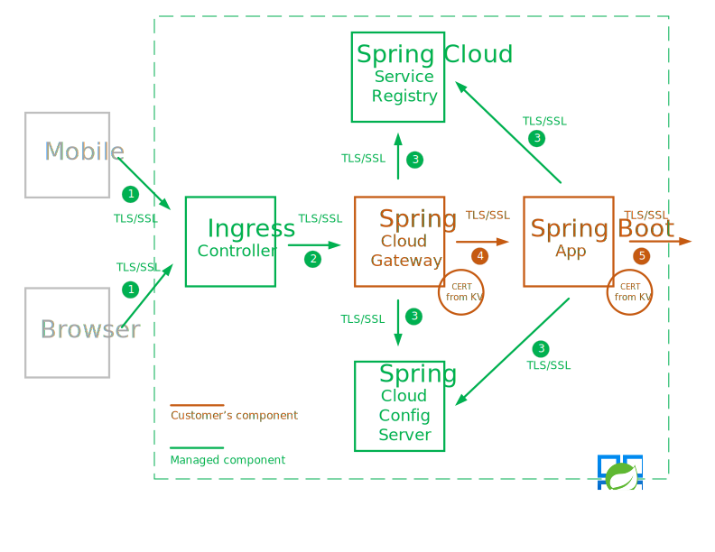
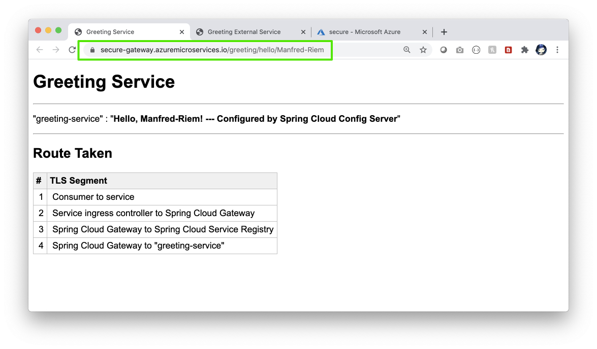
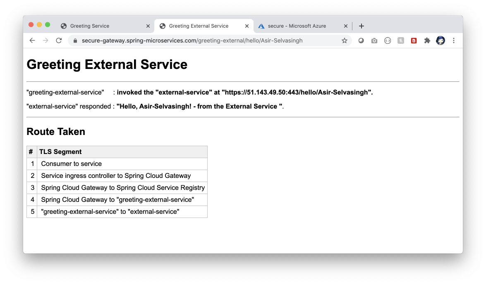
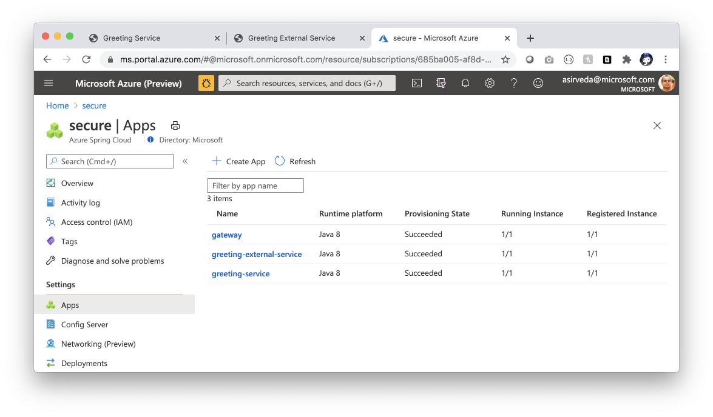

# Spring Boot - Secure Communications Using End-to-end TLS/SSL

This guide explains how to secure communications for Spring Boot apps 
using end-to-end TLS/SSL and SSL certificates managed in Azure Key Vault. 

Azure Spring Cloud is used for illustration. You can apply the same approach to 
secure communications when you deploy 
Spring Boot apps to Azure Kubernetes Service, App Service or Virtual Machines.

## What will you experience
You will:
- Deploy Spring Boot micro services
- Secure communications using end-to-end TLS/SSL
- Use Azure Key Vault to realize zero-trust model.

## What you will need

In order to deploy a Java app to cloud, you need 
an Azure subscription. If you do not already have an Azure 
subscription, you can activate your 
[MSDN subscriber benefits](https://azure.microsoft.com/pricing/member-offers/msdn-benefits-details/) 
or sign up for a 
[free Azure account]((https://azure.microsoft.com/free/)).

In addition, you will need the following:

| [Azure CLI version](https://docs.microsoft.com/cli/azure/install-azure-cli?view=azure-cli-latest) 
| [Java 8](https://www.azul.com/downloads/azure-only/zulu/?version=java-8-lts&architecture=x86-64-bit&package=jdk) 
| [Maven](https://maven.apache.org/download.cgi) 
| [Git](https://git-scm.com/)
|

## Secure Communications Using End-to-end TLS/SSL

The TLS/SSL protocol establishes identity and trust, and encrypts communications of all types, 
making secure Internet communications possible - particularly Web traffic carrying 
commerce data and personally identifiable information.

Based on the principle of "never trust, always verify", Zero Trust helps secure all 
communications by eliminating unknown and un-managed certificates and only trusts certificates 
that are shared by verifying identity prior to granting access to those certificates.

You can use any of the following types of certificates:
- CA (Certificate Authority) Certificate issued by a certificated authority (CA)
- EV (Extended Validation) Certificate is a certificate that conforms to industry 
standard certificate guidelines
- Wildcard Certificate supports any number of sub domains based on *.site.com
- Self-Signed Certificates - client browsers do not trust these certificates and will warn the
user that the certificate is not part of a trust chain. Of course, self-signed certificates are
good for dev and testing environments. Production workloads should never use 
self-signed certificates.

To securely load certificates into Spring Boot apps, we are using 
the [Azure Key Vault Certificates Spring Boot Starter](https://github.com/Azure/azure-sdk-for-java/tree/master/sdk/spring/azure-spring-boot-starter-keyvault-certificates).

```xml
<dependency>
   <groupId>com.microsoft.azure</groupId>
   <artifactId>azure-spring-boot-starter-keyvault-certificates</artifactId>
</dependency>
```

## Azure Spring Cloud

You can secure communications using end-to-end TLS/SSL in Azure Spring Cloud. Pictorially -



| # | TLS/SSL Segment                                                |
|---|----------------------------------------------------------------|
| 1 | Consumers to service                                           |
| 2 | Service ingress controller to target app, Spring Cloud Gateway |
| 3 | Spring Cloud Gateway to Spring Cloud Service Registry          |
| 4 | Spring Cloud Gateway to Spring Boot app (app to app)           |
| 5 | Spring Boot app to external systems                            |

You can secure all these segments, except 2, and support for segment 2 will be released shortly.

## Install - Azure CLI extension

Install the Azure Spring Cloud extension for the Azure CLI using the following command.

```bash
az extension add --name spring-cloud
```

## Deploy Spring Boot Apps

### Setup Environment

Let us start ...

Create a bash script with environment variables by making a copy of the supplied template.
```bash
cp .scripts/setup-env-variables-azure-template.sh .scripts/setup-env-variables-azure.sh
```

Open `.scripts/setup-env-variables-azure.sh` and enter the following information:
```bash

# Customize SPRING_CLOUD_SERVICE - set your name for Azure Spring Cloud
export SPRING_CLOUD_SERVICE=secure

# Customize KEY_VAULT value - set your name for Key Vault
export KEY_VAULT=certs-2020

# Customize CUSTOM_DOMAIN - set your custom domain for the main entry gateway
export CUSTOM_DOMAIN=secure-gateway.spring-microservices.com

# Customize CONTAINER_REGISTRY - set your name for the Container Registry
export CONTAINER_REGISTRY=springbootimages

```

Then, set the environment:
```bash
source .scripts/setup-env-variables-azure.sh
```

### Login to Azure 

Login to the Azure CLI and choose your active subscription.
```bash
az login
```

### Create Azure Key Vault and Certificates

Create a Resource Group and configure defaults.
```bash
# ==== Create Resource Group ====
az group create --name ${RESOURCE_GROUP} --location ${REGION}

az configure --defaults group=${RESOURCE_GROUP} location=${REGION} \
    spring-cloud=${SPRING_CLOUD_SERVICE}
 ```

Create a Key Vault and self-signed certificate.
```bash
# ==== Create Key Vault, self-signed certificate ====
az keyvault create --name ${KEY_VAULT} -g ${RESOURCE_GROUP}
export KEY_VAULT_URI=$(az keyvault show --name ${KEY_VAULT} | jq -r '.properties.vaultUri')

az keyvault certificate create --vault-name ${KEY_VAULT} \
    -n ${SERVER_SSL_CERTIFICATE_NAME} \
    -p "$(az keyvault certificate get-default-policy)"
```

Optionally, you may turn on [custom domain and TLS/SSL for segment 1](https://docs.microsoft.com/en-us/azure/spring-cloud/spring-cloud-tutorial-custom-domain?tabs=Azure-portal), 
consumers to Azure Spring Cloud:
- Purchase a certificate from an SSL certificate shop and download 
certificate artifacts for `Apache`.
- Convert the certificate into a format accepted by Key Vault.
- Import the converted certificate into Key Vault.
```bash
# ==== You may have to merge certificates into 1 file ====
# ==== SAMPLE SCRIPT =====================================
openssl pkcs12 -export -out myserver2.pfx -inkey privatekey.key -in mergedcert2.crt
az keyvault certificate import --file myserver2.pfx \
    --name ${CUSTOM_DOMAIN_CERTIFICATE_NAME} \
    --vault-name ${KEY_VAULT} --password 123456
```

### Deploy External Service

Deploy the `external-service` to Azure Container Instances and turn on TLS/SSL 
using certificates managed by Key Vault.
```bash
source .scripts/deploy-external-service.sh
```

### Create Azure Spring Cloud

Create Azure Spring Cloud and apply config.
```bash
# ==== Create Azure Spring Cloud ====
az spring-cloud create --name ${SPRING_CLOUD_SERVICE} --resource-group ${RESOURCE_GROUP} \
    --location ${REGION}

# ==== Apply Config ====
az spring-cloud config-server set --config-file application.yml --name ${SPRING_CLOUD_SERVICE}

# ==== Configure Defaults ===
    az configure --defaults \
        group=${RESOURCE_GROUP} \
        location=${REGION} \
        spring-cloud=${SPRING_CLOUD_SERVICE}
```

Optionally, you may import the custom domain into Azure Spring Cloud.
```bash
# ==== Import custom domain certificate ====
# First grant Azure Spring Cloud Domain Manager access to Key Vault
az ad sp show --id 03b39d0f-4213-4864-a245-b1476ec03169 --query objectId

az keyvault set-policy --name ${KEY_VAULT} \
    --object-id 938df8e2-2b9d-40b1-940c-c75c33494239 \
    --certificate-permissions get list \
    --secret-permissions get list

az spring-cloud certificate add --name ${CUSTOM_DOMAIN_CERTIFICATE_NAME} \
    --vault-uri ${KEY_VAULT_URI} \
    --vault-certificate-name ${CUSTOM_DOMAIN_CERTIFICATE_NAME}
```

### Create Apps in Azure Spring Cloud

Create `gateway` app, enable managed identities and
grant them access to the Key Vault where certificates are stored.
```bash
# ==== Create the gateway app ====
az spring-cloud app create --name gateway --instance-count 1 --is-public true \
    --memory 2 \
    --jvm-options='-Xms2048m -Xmx2048m -XX:+UnlockExperimentalVMOptions -XX:+UseCGroupMemoryLimitForHeap -XX:+UseG1GC -Djava.awt.headless=true' \
    --env KEY_VAULT_URI=${KEY_VAULT_URI} \
          GREETING_SERVICE=${GREETING_SERVICE} \
          GREETING_EXTERNAL_SERVICE=${GREETING_EXTERNAL_SERVICE}
          
# ==== Assign System Assigned Managed Identity to the gateway app ====
az spring-cloud app identity assign --name gateway
export GATEWAY_IDENTITY=$(az spring-cloud app show --name gateway | \
    jq -r '.identity.principalId')
    
# ==== Grant gateway app with access to the Key Vault ====
az keyvault set-policy --name ${KEY_VAULT} \
   --object-id ${GATEWAY_IDENTITY} --certificate-permissions get list \
   --key-permissions get list --secret-permissions get list

export SECURE_GATEWAY_URL=$(az spring-cloud app show --name gateway | jq -r '.properties.url')
```

Optionally, if you are using a custom domain for the `gateway` app, then bind the domain and 
add a DNS record with your domain service to map the domain name to
`${SECURE_GATEWAY_URL}`.
```bash
# ==== Manual step to add a DNS record to map domain name to ${SECURE_GATEWAY_URL}
# ==== Bind custom domain ====
az spring-cloud app custom-domain bind --app gateway \
    --domain-name ${CUSTOM_DOMAIN} --certificate ${CUSTOM_DOMAIN_CERTIFICATE_NAME}
```

Create `greeting-service` and `greeting-external-service` apps, enable managed identities and
grant them access to the Key Vault where certificates are stored.
```bash
# ==== Create the greeting-service app ====
az spring-cloud app create --name greeting-service --instance-count 1 \
    --memory 2 \
    --jvm-options='-Xms2048m -Xmx2048m -XX:+UnlockExperimentalVMOptions -XX:+UseCGroupMemoryLimitForHeap -XX:+UseG1GC -Djava.awt.headless=true' \
    --env KEY_VAULT_URI=${KEY_VAULT_URI} \
          SERVER_SSL_CERTIFICATE_NAME=${SERVER_SSL_CERTIFICATE_NAME}

az spring-cloud app identity assign --name greeting-service
export GREETING_SERVICE_IDENTITY=$(az spring-cloud app show --name greeting-service | \
    jq -r '.identity.principalId')

az keyvault set-policy --name ${KEY_VAULT} \
   --object-id ${GREETING_SERVICE_IDENTITY} --certificate-permissions get list \
   --key-permissions get list --secret-permissions get list

# ==== Create the greeting-external-service app ====
az spring-cloud app create --name greeting-external-service --instance-count 1 \
    --memory 2 \
    --jvm-options='-Xms2048m -Xmx2048m -XX:+UnlockExperimentalVMOptions -XX:+UseCGroupMemoryLimitForHeap -XX:+UseG1GC -Djava.awt.headless=true' \
    --env KEY_VAULT_URI=${KEY_VAULT_URI} \
          SERVER_SSL_CERTIFICATE_NAME=${SERVER_SSL_CERTIFICATE_NAME} \
          EXTERNAL_SERVICE_ENDPOINT=${EXTERNAL_SERVICE_ENDPOINT} \
          EXTERNAL_SERVICE_PORT=${EXTERNAL_SERVICE_PORT}

az spring-cloud app identity assign --name greeting-external-service
export GREETING_EXTERNAL_SERVICE_IDENTITY=$(az spring-cloud app show \
    --name greeting-external-service| jq -r '.identity.principalId')

az keyvault set-policy --name ${KEY_VAULT} \
   --object-id ${GREETING_EXTERNAL_SERVICE_IDENTITY} --certificate-permissions get list \
   --key-permissions get list --secret-permissions get list
```

### Deploy apps to Azure Spring Cloud

Deploy `gateway`, `greeting-service` and `greeting-external-service` to Azure Spring Cloud.

```bash
# ==== Build for cloud ====
mvn clean package -DskipTests -Denv=cloud

# ==== Deploy apps ====
az spring-cloud app deploy --name gateway --jar-path ${GATEWAY_JAR}

az spring-cloud app deploy --name greeting-service --jar-path ${GREETING_SERVICE_JAR}

az spring-cloud app deploy --name greeting-external-service \
    --jar-path ${GREETING_EXTERNAL_SERVICE_JAR}
```

## Open Spring Boot Apps Secured Using End-to-end TLS/SSL

Let us open the app and test it.
```bash
open ${SECURE_GATEWAY_URL}/greeting/hello/Manfred-Riem
open ${SECURE_GATEWAY_URL}/greeting/hello-external/Asir-Selvasingh
```







## Next Steps

In this guide, you secured communications for Spring Boot apps 
using end-to-end TLS/SSL and SSL certificates managed in Azure Key Vault. You can learn more.

- [Azure Spring Cloud](https://azure.microsoft.com/en-us/services/spring-cloud/)
- [Azure Spring Cloud docs](https://docs.microsoft.com/en-us/azure/java/)
- [Deploy Spring microservices from scratch](https://github.com/microsoft/azure-spring-cloud-training)
- [Deploy existing Spring microservices](https://github.com/Azure-Samples/spring-petclinic-microservices)
- [Azure for Java Cloud Developers](https://docs.microsoft.com/en-us/azure/java/)
- [Spring Cloud Azure](https://cloud.spring.io/spring-cloud-azure/)
- [Spring Cloud](https://spring.io/projects/spring-cloud)

## Contributing

This project welcomes contributions and suggestions.  Most contributions require you to agree to a
Contributor License Agreement (CLA) declaring that you have the right to, and actually do, grant us
the rights to use your contribution. For details, visit https://cla.opensource.microsoft.com.

When you submit a pull request, a CLA bot will automatically determine whether you need to provide
a CLA and decorate the PR appropriately (e.g., status check, comment). Simply follow the instructions
provided by the bot. You will only need to do this once across all repos using our CLA.

This project has adopted the [Microsoft Open Source Code of Conduct](https://opensource.microsoft.com/codeofconduct/).
For more information see the [Code of Conduct FAQ](https://opensource.microsoft.com/codeofconduct/faq/) or
contact [opencode@microsoft.com](mailto:opencode@microsoft.com) with any additional questions or comments.
